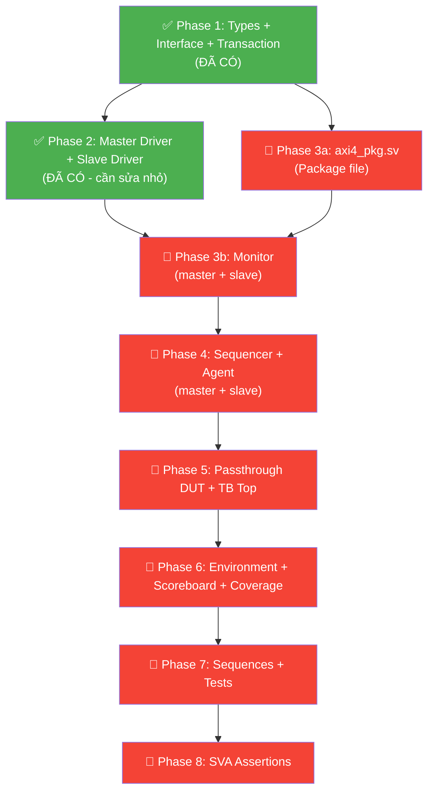

# 📊 AXI4 VIP — Đánh Giá Kiến Trúc vs Code Hiện Tại

## Sơ Đồ Kiến Trúc Mục Tiêu


---

## ✅ Đã Có (5 files)

| # | Component | File | Trạng thái |
|---|-----------|------|-----------|
| 1 | **Types/Params** | [axi4_types.sv](file:///d:/Code/axi4_vip/src/axi4_pkg/axi4_types.sv) | ✅ Hoàn chỉnh |
| 2 | **Transaction** | [axi4_transaction.sv](file:///d:/Code/axi4_vip/src/axi4_pkg/axi4_transaction.sv) | ✅ Hoàn chỉnh |
| 3 | **Interface** | [axi4_if.sv](file:///d:/Code/axi4_vip/src/axi4_pkg/axi4_if.sv) | ✅ Hoàn chỉnh |
| 4 | **Master Driver** | [axi4_master_driver.sv](file:///d:/Code/axi4_vip/src/axi4_pkg/axi4_master_driver.sv) | ⚠️ Cần sửa nhỏ |
| 5 | **Slave Driver** | [axi4_slave_driver.sv](file:///d:/Code/axi4_vip/src/axi4_pkg/axi4_slave_driver.sv) | ⚠️ Cần sửa nhỏ |

---

## ❌ Còn Thiếu — Theo Kiến Trúc

Đối chiếu với sơ đồ, các thành phần sau **chưa có code**:

### Trong `axi4_pkg/` (VIP core — reusable)

| # | Component | File cần tạo | Mô tả |
|---|-----------|-------------|-------|
| 1 | **Master Monitor** | `axi4_master_monitor.sv` | Passive observe tín hiệu AXI4 phía master, gửi transaction qua `analysis_port` |
| 2 | **Slave Monitor** | `axi4_slave_monitor.sv` | Passive observe phía slave (cùng logic, khác modport) |
| 3 | **Master Sequencer** | `axi4_master_sequencer.sv` | `uvm_sequencer #(axi4_transaction)` cho master |
| 4 | **Slave Sequencer** | `axi4_slave_sequencer.sv` | `uvm_sequencer #(axi4_transaction)` cho slave |
| 5 | **Master Agent** | `axi4_master_agent.sv` | Đóng gói Sequencer + Driver + Monitor |
| 6 | **Slave Agent** | `axi4_slave_agent.sv` | Đóng gói Sequencer + Driver + Monitor |
| 7 | **Agent Config** | `axi4_agent_config.sv` | Config object (active/passive, has_coverage, ...) |
| 8 | **Package file** | `axi4_pkg.sv` | `package` file import tất cả components |

### Trong `env/` (Testbench environment)

| # | Component | File cần tạo | Mô tả |
|---|-----------|-------------|-------|
| 9 | **Environment** | `axi4_vip_env.sv` | Instantiate Master Agent + Slave Agent + Scoreboard + Coverage |
| 10 | **Env Config** | `axi4_vip_env_config.sv` | Config cho environment |
| 11 | **Scoreboard** | `axi4_scoreboard.sv` | So sánh transaction master ↔ slave |
| 12 | **Coverage** | `axi4_coverage.sv` | Functional coverage collector |

### Trong `src/` (SVA, DUT, Sequences, Tests, TB)

| # | Component | File cần tạo | Mô tả |
|---|-----------|-------------|-------|
| 13 | **SVA bind** | `axi4_sva.sv` | Protocol assertions (VALID/READY rules, WLAST, RLAST...) |
| 14 | **Passthrough DUT** | `axi4_passthrough.sv` | Simple interconnect nối thẳng signals |
| 15 | **Sequences** | `seq_lib/*.sv` | Master/Slave sequences (write, read, burst, random...) |
| 16 | **Tests** | `test/*.sv` | UVM test cases |
| 17 | **TB Top** | `tb/tb_top.sv` | Top module: clock, reset, interface, DUT, `run_test()` |

---

## ⚠️ Vấn Đề Cần Sửa Trong Code Hiện Tại

### 1. Master Driver — [axi4_master_driver.sv](file:///d:/Code/axi4_vip/src/axi4_pkg/axi4_master_driver.sv)

**Vấn đề: W channel có thể mất 1 cycle đầu do `@(vif.master_cb)` trước khi drive**

```diff
 // Line 119-130: drive_w_channel
 task drive_w_channel(axi4_transaction tr);
     for (int i = 0; i <= tr.len; i++) begin
         @(vif.master_cb);
         vif.master_cb.WVALID <= 1'b1;
         vif.master_cb.WDATA  <= tr.data[i];
         vif.master_cb.WSTRB  <= tr.strb[i];
         vif.master_cb.WLAST  <= (i == tr.len) ? 1'b1 : 1'b0;

         // Wait for WREADY handshake
         do @(vif.master_cb);
         while (!vif.master_cb.WREADY);
     end
```

> [!NOTE]
> Logic handshake cơ bản đúng. Tuy nhiên, khi W channel chạy song song với AW channel (dùng `fork...join`), cần lưu ý rằng AXI4 spec cho phép W data đến trước AW address. Code hiện tại đã hỗ trợ điều này nhờ `fork`. Đây là **acceptable behavior**.

### 2. Slave Driver — [axi4_slave_driver.sv](file:///d:/Code/axi4_vip/src/axi4_pkg/axi4_slave_driver.sv)

**Vấn đề 1: Slave driver là reactive nhưng vẫn extend `uvm_driver`**

Slave driver hiện tại lắng nghe bus trực tiếp (reactive) mà **không dùng sequencer**. Đây là approach hợp lệ cho giai đoạn đầu, nhưng sẽ cần refactor khi muốn hỗ trợ sequence-driven responses (error injection, custom delays...).

**Vấn đề 2: AWREADY/WREADY chỉ assert 1 cycle (no back-pressure simulation)**

```systemverilog
// Line 96-98
vif.slave_cb.AWREADY <= 1'b1;
@(vif.slave_cb);
vif.slave_cb.AWREADY <= 1'b0;
```

> [!TIP]
> Nên thêm configurable delay trước khi assert READY để simulate back-pressure. Ví dụ: `repeat(cfg.ready_delay) @(vif.slave_cb);` trước khi assert.

### 3. Transaction — [axi4_transaction.sv](file:///d:/Code/axi4_vip/src/axi4_pkg/axi4_transaction.sv)

> [!NOTE]
> `rresp[]` (line 40) dùng enum array nhưng không có `uvm_field_*` macro (đã ghi chú ở line 60). Cần implement `do_copy`, `do_compare`, `do_print` thủ công cho field này để scoreboard hoạt động đúng.

### 4. Thiếu `axi4_pkg.sv` — Package file

Tất cả file hiện tại đều ghi "This file is `included inside axi4_pkg.sv" nhưng file `axi4_pkg.sv` **chưa tồn tại**.

---

## 🗺️ Lộ Trình Implement — Thứ Tự Ưu Tiên



### Nên bắt đầu ngay với:

1. **`axi4_pkg.sv`** — Cần có trước để compile tất cả components
2. **`axi4_master_monitor.sv`** + **`axi4_slave_monitor.sv`** — Thiếu Monitor thì không thể có Scoreboard/Coverage
3. **`axi4_master_agent.sv`** + **`axi4_slave_agent.sv`** — Đóng gói thành agents theo sơ đồ

---

## 📝 Tóm Tắt

| Hạng mục | Số lượng |
|----------|---------|
| Files đã có | **5** |
| Files cần tạo mới | **~15** |
| Files cần sửa | **2-3** (driver + transaction) |
| Ước tính hoàn thành | Phase 3-8 trong [implementation_plan.md](file:///d:/Code/axi4_vip/implementation_plan.md) |
